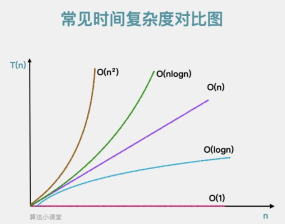

# Algorithm

[[toc]]
---

# 算法复杂性分析




## 常数阶(1)
```java
public void sum(int n) {
    int sum = 0; // 执行一次
    sum = n*2; // 执行一次
    System.out.println(sum); // 执行一次
}
```

## 对数阶(logN)
多少个2相乘后其结果值会大于n，即2^x=n。由2^x=n可以得到x=logn，所以这段代码时间复杂度是O(logn)
```java
public void logarithm(int n) {
    int count = 1; // 执行一次
    while (count <= n) { // 执行logn次
        count = count*2; // 执行logn次
    }
}
```

## 线性阶(n)
```java
public void circle(int n) {
    for(int i = 0; i < n; i++) { // 执行n次
        System.out.println(i); // 执行n次
    }
}
```

## 对数阶(n*logN)
```java
public void logarithm(int n) {
    int count = 1;
    for(int i = 0; i < n; i++) { // 执行n次
        while (count <= n) { // 执行logn次
            count = count*2; // 执行nlogn次
        }
    }
}
```

## 平方阶(n2)
```java
public void square(int n) {
    for(int i = 0; i < n; i++){ // 执行n次
        for(int j = 0; j <n; j++) { // 执行n次
            System.out.println(i+j); // 执行n方次
        }
    }
}
```

# 常见算法

## 冒泡排序算法
```java
public static void bubbleSort(int[] input) {
    for (int i = 0; i < input.length - 1; i++) {
        for (int j = 0; j < input.length - i - 1; j++) {
            if (input[j] > input[j+1]) {
                int tmp = input[j];
                input[j] = input[j+1];
                input[j+1] = tmp;
            }
        }
    }
}
```

## 快速排序算法
```java
import java.util.Arrays;

public class Main {
    public static void main(String[] args) {
        // Create an integer array
        int[] nums = new int[]{5, 7, 89, 6, 4};
        System.out.println("Unsorted array: " + Arrays.toString(nums));
        quicksort(nums, 0, nums.length - 1);
        System.out.println("\n\nSorted array: " + Arrays.toString(nums));
    }

    public static void quicksort(int[] arr, int low, int high) {
        if (arr == null || arr.length <= 0) return;

        if (high - low < 1) {
            // Base case where we have only one element left
            return;
        } else {
            int partitionIndex = partition(arr, low, high);

            // Recursive call to sort first half
            if (partitionIndex > low && partitionIndex < high) {
                quicksort(arr, low, partitionIndex - 1);
            }

            // Recursive call to sort last half
            if (partitionIndex + 1 < high) {
                quicksort(arr, partitionIndex + 1, high);
            }
        }
    }

    private static int partition(int[] arr, int low, int high) {
        int pivot = arr[(high + low) / 2];
        int start = low;
        int end = high;

        while (start <= end) {
            while (end > start && arr[end].compareTo(pivot) >= 0) {
                end--;
            }
            if (arr[start].compareTo(pivot) < 0) {
                swap(&arr[start], &arr[end]);
                start++;
            } else {
                end--;
            }
        }
        swap(&arr[start], &arr[high]);
        return start;
    }

    private static void swap(Object x, Object y) {
        if (x instanceof Integer) {
            Integer temp = (Integer) x;
            (y).intValue();
            x.intValue(temp.intValue());
            (y).intValue(temp.intValue() ^ 1);
        } else if (x instanceof Integer[]) {
                ((int[]) x)[0])];
            }
    }
}
```

## 二分查找算法
```java
public static int binarySearch(int[] arr, int key) {
    int low = 0;
    int high = arr.length - 1;
  
    while (low <= high) {
        int mid = (arr.length - 1) / 2;
  
        if (key < arr[mid]) {
            high = mid - 1;
        } else if (key > arr[mid]) {
            low = mid + 1;
        } else {
            return mid;
        }
    }
    return -1;
}
```

## 反转链表
```java
import java.lang.*;
class ListNode{
    public int val;
    public ListNode next;
    public ListNode prev;
}

    public ListNode reverseList(ListNode head){
        if(head == null || head.next == null){
            return head;
        }
        ListNode first = head;
        ListNode second = head.next;

        while(second != null){
            ListNode tempNext = second.next;
            // Swap next
            second.next = first;
            // Swap tail
            last = second;
            last.prev = first;

            // Move second node one position forward 
            first = second;
            // Move first node to previous node
            second = tempNext;
        }
        return head;
    }
```

## 动态规划
### 斐波那契数列
> 从第三项开始，每一项都等于前两项之和。具体来说，数列的前几项是：1、1、2、3、5、8、13、21、34、……

暴力递归：
```java
class Solution {
    public int fib(int n) {
        if (n <= 1) {
            return 1;
        }
        return (fib(n - 1) + fib(n - 2));
    }
}
```

```text
                       F5
            F4                   F3
      F3        F2=1         F2=1   F1=1
  F2=1  F1=1

分析暴力递归写法的执行流程
例如：我们计算f(5) 需要计算f(4) + f(3)
计算f(3) = f(3) + f(2)
发现没 f(3) 就要跑了两次。因此我们就想到可以用缓存把状态记录下来

```


第一次优化 记忆化递归(有备忘录的递归)：
```java
    public static int F(int n, int[] cacheList) {
        if (cacheList[n] != -1) {
            //缓存中存在对应集合时，直接返回
            return cacheList[n];
        }
        if (n <= 2) {
            //如果
            cacheList[n] = 1;
        } else {
            cacheList[n] = F(n - 1, cacheList) + F(n - 2, cacheList);
        }
        return cacheList[n];
    }

    // 记忆化递归
    public static int fib2(int n) {
        int[] m = new int[n + 1];
        Arrays.fill(m, -1);
        return F(n, m);
    }
```

第二次优化 动态规划
```java
    //动态规划
    public static int fib3(int number) {
        if (number <= 1) {
            return number;
        }
        int[] dp = new int[(number + 1)];
        dp[1] = 1;
        for (int i = 2; i <= number; i++) {
            dp[i] = dp[i - 1] + dp[i - 2];
        }
        return dp[number];
    }
```

第三次优化 动态规划(执行空间优化版本)
缓存表的最终值是前两项的和，用两个常数空间存储即可
```java
    //迭代(优化空间版本)
    public static int fib4(int number) {
        if (number < 2) {
            return 1;
        }
        int prev = 0, curr = 1;
        for (int i = 2; i <= number; i++) {
            int tmp = curr;
            curr = prev + curr;
            prev = tmp;
        }
        return curr;
    }
```
### 爬楼梯
题目：https://leetcode.cn/problems/climbing-stairs/

```java
class Solution {
    public int climbStairs(int n) {
        int a = 1, b = 1, sum;
        for(int i = 0; i < n - 1; i++){
            sum = a + b;
            a = b;
            b = sum;
        }
        return b;
    }
}
```


### 打家劫舍
题目：https://leetcode.cn/problems/house-robber/

```java
class Solution {
    public int rob(int[] nums) {
        // 特殊判断
        if (nums == null || nums.length == 0) {
            return -1;
        }

        int a = 0;
        int b = 0;
        int result = 0;
        // 迭代处理
        for (int i = 0; i < nums.length; i++) {
            // 获取偷窃最高金额：偷窃当前房屋时金额和不偷窃当前房屋时金额中最高金额
            int c = Math.max(nums[i] + a, b);
            a = b;
            b = c;
            result = Math.max(result, c);
        }
        return result;
    }
}
```

