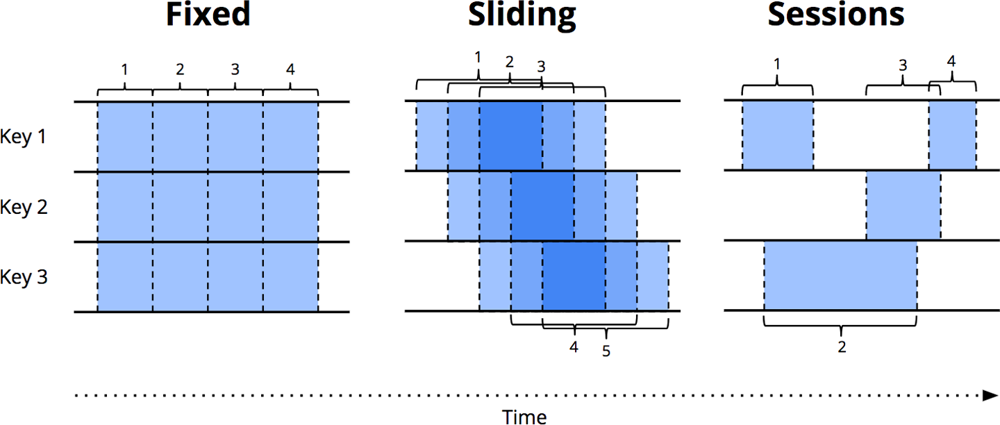
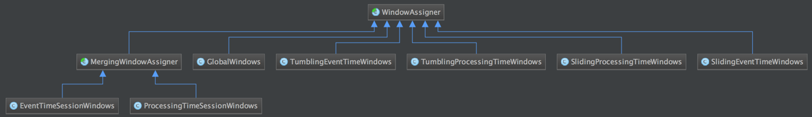
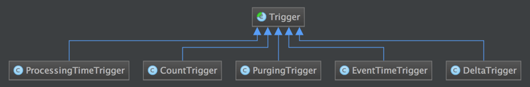
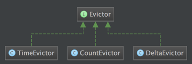

# Flink-FastSteps

[[toc]]
---

# 概念：
- https://mp.weixin.qq.com/s/oBmRhRA-52CLRLXp6sZwEw
- https://matt33.com/2019/11/23/flink-learn-start-1/

# 一、应用场景：
1、Data Pipeline
实时数仓
2、Data Analytics
实时大屏
实时报表
3、Data Driven
风控系统

# 二、windows&watermark
```java
//开窗测试 指定窗口分配器
DataStream<Integer> resultStream = dataStream.keyBy("id")
        //设置一个15秒的一个滚动窗口
        .window(TumblingProcessingTimeWindows.of(Time.seconds(15)));
		//滑动窗口
        //.window(SlidingProcessingTimeWindows.of(Time.seconds(20),Time.seconds(10)))
        //会话窗口
        //.window(ProcessingTimeSessionWindows.withGap(Time.seconds(15)))

env.execute();
```

- Tumbling Windows：统计每一分钟中用户购买的商品的总数，需要将用户的行为事件按每一分钟进行切分，这种切分被成为翻滚时间窗口；
- Slidding Windows：每30秒计算一次最近一分钟用户购买的商品总数；
- Session Windows：一计算每个用户在活跃期间总共购买的商品数量，如果用户30秒没有活动则视为会话断开

Window解决了什么问题？
在流处理应用中，数据是连续不断的，因此我们不可能等到所有数据都到了才开始处理。当然我们可以每来一个消息就处理一次，但是有时我们需要做一些聚合类的处理，例如：在过去的1分钟内有多少用户点击了我们的网页。在这种情况下，我们必须定义一个窗口，用来收集最近一分钟内的数据，并对这个窗口内的数据进行计算。

Watermark解决了什么问题？
实时系统中，由于各种原因造成的延时，造成某些消息发到flink的时间延时于事件产生的时间。如果基于event time构建window，但是对于late element，我们又不能无限期的等下去，必须要有个机制来保证一个特定的时间后，必须触发window去进行计算了。这个特别的机制，就是watermark。默认是丢弃，也可以通过配置allowedLateness()延迟丢弃
```java
val outputWindow: DataStream[String] = waterMarkStream
      .keyBy(0)
      .window(TumblingEventTimeWindows.of(Time.seconds(3)))
      // .allowedLateness(Time.seconds(2))//允许数据迟到2S
```

剖析 Window API
Flink 中定义一个窗口主要需要以下三个组件。

- Window Assigner：用来决定某个元素被分配到哪个/哪些窗口中去。如下类图展示了目前内置实现的 Window Assigners：
  
- Trigger：触发器。决定了一个窗口何时能触发计算输出结果，每个窗口都会拥有一个自己的Trigger。
  
- Evictor：可以译为“驱逐者”。在Trigger触发之后，在窗口被处理之前，Evictor（如果有Evictor的话）会用来剔除窗口中不需要的元素，相当于一个filter。
  
  
上述三个组件的不同实现的不同组合，可以定义出非常复杂的窗口。Flink 中内置的窗口也都是基于这三个组件构成的，当然内置窗口有时候无法解决用户特殊的需求，所以 Flink 也暴露了这些窗口机制的内部接口供用户实现自定义的窗口。

窗口在类别上有两大类：
时间窗口.timewindow()和计数窗口.countwindow()

其中时间窗口有两种使用方法：
一个是.timewindow()通过输入的参数区分窗口类别。
```java
//滚动窗口
.timeWindow(Time.seconds(15))
//滑动窗口
.timeWindow(Time.seconds(15),Time.seconds(5))
//会话窗口
.window(ProcessingTimeSessionWindows.withGap(Time.seconds(15)))

//计数滚动窗口
.countWindow(10)
//滑动计数窗口
.countWindow(10,2)

```
一个是.window()在参数中声明窗口
```java
//滚动窗口
.window(TumblingProcessingTimeWindows.of(Time.seconds(15)));
//滑动窗口
.window(SlidingProcessingTimeWindows.of(Time.seconds(20),Time.seconds(10)))
//会话窗口
.window(ProcessingTimeSessionWindows.withGap(Time.seconds(15)))

//计数滚动窗口
.countWindow(10)
//滑动计数窗口
.countWindow(10,2)
```
窗口函数分为两类：增量聚合函数、全量聚合函数
增量聚合函数：ReduceFunction、AggregateFunction
```java
//对窗口进行聚合操作 增量窗口操作
.timeWindow(Time.seconds(15))
.aggregate(new AggregateFunction<SensorReading, Integer, Integer>() {
    @Override
    //创建累加器
    public Integer createAccumulator() {
        return 0;
    }
    @Override
    public Integer add(SensorReading sensorReading, Integer accumulator) {
        return accumulator+1;
    }
    @Override
    public Integer getResult(Integer accumulator) {
        return accumulator;
    }
    @Override
    public Integer merge(Integer integer, Integer acc1) {
        return null;
    }
});
```

全量聚合函数：ProcessWindowFunction，WindowFunction
```java
.timeWindow(Time.seconds(15))
.apply(new WindowFunction<SensorReading, Tuple3<String,Long,Integer>,
Tuple, TimeWindow>() {

    @Override
    public void apply(Tuple tuple, 
                      TimeWindow window, 
                      Iterable<SensorReading> input, 
                      Collector<Tuple3<String,Long,Integer>> out) throws Exception {
        String id =tuple.getField(0);
        Long windowEnd =window.getEnd();
        Integer count = IteratorUtils.toList(input.iterator()).size();
        out.collect(new Tuple3<>(id,windowEnd,count));
    }
});
```


