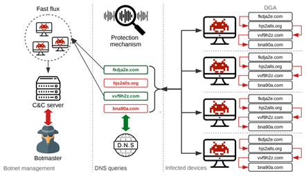

# DGA

[[toc]]
---

## 一、基本概念



- 僵尸网络(Botnet)：互联网上在蠕虫、木马、后门工具等，传统恶意代码形态的基础上发展、融合而产生的一种新型攻击方法。
- DNS(Domain Name System) ：基于 UDP 的应用层协议。主要用途是将一个域名解析成 IP 地址，这个过程叫做域名解析 (Name resolution)。
- 域名生成算法(Domain Generation Algorithm)：是一种利用随机字符来生成C&C域名,从而逃避域名黑名单检测的技术手段。

```txt
　　僵尸网络&恶意软等程序，随着检测手段的更新(在早期，僵尸主机通产采用轮询的方法访问硬编码的C&C域名或IP来访问服务器获取域名，但是这种方式在安全人员进行逆向之后会得到有效的屏蔽)，黑客们也升级了肉鸡的C&C手段；用DGA算法在终端生成大量备选域名，而攻击者与恶意软件运行同一套DGA算法，生成相同的备选域名列表。
　　当需要发动攻击的时候，选择其中少量进行注册，便可以建立通信，并且可以对注册的域名应用速变IP技术，快速变换IP，从而域名和IP都可以进行快速变化。目前，黑客攻击者为了防止恶意域名被发现，会使用Domain Flux或者IP Flux来快速生成大量的恶意域名。(Domain Flux是通过不断变换域名，指向同一个IP，IP Flux是只有一个域名，不断变换IP，一个域名可以使用多个IP)。
　　很显然，在这种方式下，传统基于黑名单的防护手段无法起作用，一方面，黑名单的更新速度远远赶不上DGA域名的生成速度，另一方面，防御者必须阻断所有的DGA域名才能阻断C2通信，因此，DGA域名的使用使得攻击容易，防守困难。
```
## 二、DGA分类
DGA算法由两部分构成，种子（算法输入）和算法，可以根据种子和算法对DGA域名进行分类

### 种子分类：
- 基于时间的种子（Time dependence）。
DGA算法将会使用时间信息作为输入，如：感染主机的系统时间，http响应的时间等。

- 是否具有确定性（Determinism）。
主流的DGA算法的输入是确定的，因此AGD可以被提前计算，但是也有一些DGA算法的输入是不确定的
如：Bedep[4]以欧洲中央银行每天发布的外汇参考汇率作为种子，Torpig[5]用twitter的关键词作为种子，只有在确定时间窗口内注册域名才能生效。

### 算法分类：
现有DGA生成算法一般可以分为如下4类：

- 1.基于算术。该类型算法会生成一组可用ASCII编码表示的值，从而构成DGA域名，流行度最高。

- 2.基于哈希。用哈希值的16进制表示产生DGA域名，被使用的哈希算法常有：MD5，SHA256。

- 3.基于词典。该方式会从专有词典中挑选单词进行组合，减少域名字符上的随机性，迷惑性更强，字典内嵌在恶意程序中或者从公有服务中提取。

- 4.基于排列组合。对一个初始域名进行字符上的排列组合。

## 三、检测方法

|模型    |适用否|优点   |缺点          |
|-------|-----|-------|-------------|
|随机森林|中等  |对统计特征敏感，训练简单，解释性强|复杂模式表现有限 |
|SVM    |有限  |高维数据表现良好，小样本下效果好  |大规模数据扩展性差|
|逻辑回归|有限  |简单快速，适合线性问题  |无法处理复杂域名生成模式|
|LSTM   |很适用|适合动态和复杂的DGA  |训练耗时长，对长序列仍存在瓶颈|
|CNN    |适用  |特征提取能力强，计算效率高 |序列全局建模能力不足|
|BERT   |很适用|全局建模能力强，适合复杂DGA和未知生成规则的检测  |模型复杂，资源需求高|

> 对于简单任务或有限资源场景，可以选择 `随机森林` 或`逻辑回归`

> 对于复杂和未知的 DGA 检测任务，建议优先使用 `LSTM`或 `BERT`

算法原理
- Random Forest（随机森林）
原理：用多棵决策树分别对问题进行预测，通过投票确定最终结果。
例子：检测一个域名是否为 DGA（恶意生成域名）。
每棵树依据不同的特征（比如域名长度、字符分布、元音比例）判断是否恶意。
有些树认为是恶意，有些认为不是，最后按照多数投票决定结果。

- 逻辑回归（Logistic Regression）
原理：用特征计算出每种可能的概率，选择概率最大的结果作为预测。
例子：预测域名是否是恶意生成。
输入特征（如域名长度、重复字符数等），模型输出“是恶意域名”的概率为 0.8，“不是恶意域名”的概率为 0.2。
因为恶意概率更高，模型的结果就是“恶意域名”。

- LSTM（长短期记忆网络）
原理：处理序列数据，能记住前面的字符和上下文关系，预测接下来的内容或分类。
例子：检测域名是否是 DGA 生成。
输入一个域名“xvyrhndq.com”，LSTM 逐字符分析，比如前几个字符看起来随机（“xvy”），后续字符也没有常见模式。
模型通过记住整个域名的上下文，判断这个域名是随机生成的（DGA 域名）。

- BERT
原理：利用上下文语义，从整体中捕捉复杂关系，适合文本分类和序列建模。
例子：对域名分类，判断其是否为恶意生成。
输入一个域名“bank-login-secure.com”，BERT 通过分析前后字符的语义关系，发现“bank”和“login”之间有语义联系，倾向认为它是正常域名。
输入另一个域名“a1b2c3d4.com”，BERT 分析后认为字符没有语义关联，可能是恶意域名。


代码示例：

```ipynb
#倒入依赖库

```

```ipynb
#加载数据
```

```ipynb
#清洗数据
```

```ipynb
#训练集测试集分类
```

```ipynb
#模型构建&训练
```

```ipynb
#模型验证评测
```

```ipynb
#模型导出
```

```ipynb
#业务应用
```

【参考】：
https://www.hindawi.com/journals/scn/2021/8887881/
https://www.secrss.com/articles/14369
https://github.com/360netlab/DGA

Data:
https://osint.bambenekconsulting.com/feeds/
https://data.netlab.360.com/dga/
http://s3.amazonaws.com/alexa-static/top-1m.csv.zip
