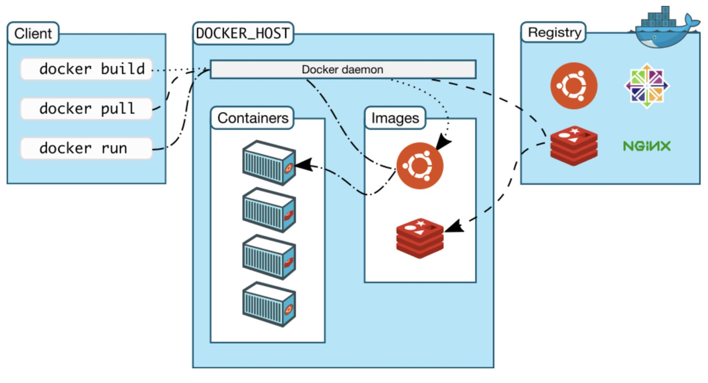

# Docker

[[toc]]
---
# Docker

## 1、Docker是什么？


Docker 基于 Linux 内核的 cgroup，namespace，以及 OverlayFS 类的 Union FS 等技术，对进程进行封装隔离，属于 操作系统层面的虚拟化技术。
由于隔离的进程独立于宿主和其它的隔离的进程，因此也称其为容器。

Docker 在容器的基础上，进行了进一步的封装，从文件系统、网络互联到进程隔离等等，极大的简化了容器的创建和维护。
使得 Docker 技术比虚拟机技术更为轻便、快捷。

## 2、Docker解决了什么问题？
### 2.1、在Docker诞生之前存在什么问题？

- 没有版本控制，每次上线前要对老包备份。
- 没有统一配置，集群里各个硬件节点规格不一样。
- 没有统一的环境，dev环境和test环境和prod环境不一样。
- 没有隔离，ES和Redis、kafka运行在一起，抢占资源。
- 无法移植。

### 2.2、Docker的优点：

- 更高效的利用系统资源
> Docker 容器不需硬件虚拟和运行操作系统的开销,因此在同等配置下,主机可以运行更多数量的应用。

- 更快速的启动时间
> Docker 容器直接运行于宿主机内核,避免启动完整操作系统,从而实现秒级甚至毫秒级的应用启动。

- 一致的运行环境
> Docker 镜像提供除内核外完整的运行环境,确保从开发到生产的环境一致性,避免了「代码在我机器上没问题」这类问题的出现。

- 持续交付和部署
> 对开发和运维人员来说,Docker 可以通过制作应用镜像,实现从持续集成到持续交付及自动化部署,整个过程透明且高效。

- 更轻松的迁移
> Docker 容器化应用执行环境,使应用迁移到任意平台时环境一致、顺利运行。

- 更轻松的维护和扩展
> Docker 利用分层存储和镜像技术,使应用复用、维护和定制变得简单高效,配合优质官方镜像,可直接用于生产或定制使用,大幅降低应用镜像制作成本。

## 3、安装docker

docker_install.sh

::: code-tabs#bash

@tab ubuntu


```bash
#!/usr/bin/bash
 
sudo apt-get remove docker
sudo apt-get remove docker-engine
sudo apt-get remove docker.io
sudo apt-get update
sudo apt-get install apt-transport-https ca-certificates curl gnupg lsb-release -y
curl -fsSL https://mirrors.aliyun.com/docker-ce/linux/ubuntu/gpg | sudo gpg --dearmor -o /usr/share/keyrings/docker-archive-keyring.gpg
echo "deb [arch=amd64 signed-by=/usr/share/keyrings/docker-archive-keyring.gpg] https://mirrors.aliyun.com/docker-ce/linux/ubuntu  $(lsb_release -cs) stable" | sudo tee /etc/apt/sources.list.d/docker.list > /dev/null
sudo apt-get update
sudo apt-get install docker-ce docker-ce-cli containerd.io -y

sudo systemctl enable docker
sudo systemctl start docker
```

@tab CentOS

```bash
#!/usr/bin/bash

yum -y update
yum remove docker  docker-client \
docker-client-latest docker-common \
docker-latest docker-latest-logrotate \
docker-logrotate docker-engine

yum install -y yum-utils device-mapper-persistent-data lvm2
yum-config-manager --add-repo http://mirrors.aliyun.com/docker-ce/linux/centos/docker-ce.repo
yum install -y docker-ce docker-ce-cli containerd.io docker-compose-plugin

systemctl enable docker.service
systemctl restart docker
```

:::

## 4、docker命令
### 4.1、image
```sh
#查看服务器中docker 镜像列表：
docker images

#搜索镜像：
docker search [镜像名]

#拉取镜像：
docker pull 镜像名 
docker pull 镜像名:tag

#运行镜像:
docker run 镜像名
docker run 镜像名:Tag
docker stop containerId // containerId 是容器的ID

#修改镜像：
docker ps
docker commit x7205xxxxxx1 sequenceiq/hadoop-docker:2.7.0-7

#删除一个
docker rmi -f 镜像名/镜像ID

#删除全部镜像  -a 意思为显示全部, -q 意思为只显示ID
docker rmi -f $(docker images -aq)

#强制删除镜像
docker image rm 镜像名称/镜像ID

#保存镜像(将我们的镜像 保存为tar 压缩文件 这样方便镜像转移和保存 ,然后 可以在任何一台安装了docker的服务器上 加载这个镜像)
docker save -o rocketmq.tar

#加载镜像(任何装 docker 的地方加载镜像保存文件,使其恢复为一个镜像)
docker load --input rocketmq.tar 或 docker load < rocketmq.tar
```
### 4.1、文件
```sh
#文件映射
docker run -v /etc/config:/etc/config my_image

#文件cp
docker cp /mnt/c/Users/wxx/Downloads/kafka_2.12-2.1.2.tar.gz 64222xxx110:/usr/local/
```
### 4.2、容器
```sh
#查看正在运行的容器列表
docker ps

#查看所有容器
docker ps -a

#创建并启动容器
> docker run -itd --name=kylin-test --net=host kylin-os-backup:latest /bin/bash

#停用
docker stop xxxx
```

## 5、Dockerfile
### 5.1、本地文件
#### 5.1.1、创建dockerfile项目
```bash
$ mkdir redis && cd redis
$ touch Dockerfile
```
```txt
FROM centos
RUN yum -y install wget \
    && wget -O redis.tar.gz "http://download.redis.io/releases/redis-5.0.3.tar.gz" \
    && tar -xvf redis.tar.gz \
    && rm redis.tar.gz
```
#### 5.1.2、构建
```bash
docker build -t redis:test .
```
#### 5.1.3、运行
```bash
docker run -d -p 6379:6379 --name redis redis:test
```

### 5.2、git构建
```bash
docker build -t hello-world https://github.com/docker-library/hello-world.git#master:amd64/hello-world
```

### 5.3、标准输入构建
```bash
docker build -t mybusybox:latest -<<EOF
FROM busybox
RUN echo "hello world"
EOF
```


## 6、例子

### 6.1、启动一个本地hadoop镜像
下载image
```bash
docker pull sequenceiq/hadoop-docker:2.7.1
```

启动容器
```bash
#后台运行
sudo docker run -dti --hostname bigdatadev.host \
-p 50070:50070 -p 9000:9000 -p 8088:8088 -p 8040:8040 -p 8042:8042 -p 49707:49707 \
-p 50010:50010 -p 50075:50075 -p 50090:50090 -p 2181:2181 -p 9092:9092 \
sequenceiq/hadoop-docker:2.7.0 /etc/bootstrap.sh -bash --privileged=true
```

测试：
```text
hdfs-ui
http://localhost:50070/dfshealth.html#tab-overview

yarn-ui
http://localhost:8088/cluster/apps/RUNNING
```


## 7、docker 镜像加速
7.1、配置
镜像加速器 | 镜像加速器地址 | 其它加速[？](# "支持哪些镜像来源的镜像加速")
--- | --- | ---
[DaoCloud 镜像站](https://github.com/DaoCloud/public-image-mirror) | `https://docker.m.daocloud.io` |  Docker Hub、GCR、K8S、GHCR、Quay、NVCR 等
[网易云](https://c.163yun.com/hub) | `https://hub-mirror.c.163.com` | Docker Hub
[Docker 镜像代理](https://dockerproxy.com) | `https://dockerproxy.com` | Docker Hub、GCR、K8S、GHCR
[百度云](https://cloud.baidu.com/doc/CCE/s/Yjxppt74z#%E4%BD%BF%E7%94%A8dockerhub%E5%8A%A0%E9%80%9F%E5%99%A8) | `https://mirror.baidubce.com` | Docker Hub
[南京大学镜像站](https://doc.nju.edu.cn/books/35f4a) | `https://docker.nju.edu.cn` | | Docker Hub、GCR、GHCR、Quay、NVCR 等
[上海交大镜像站](https://mirrors.sjtug.sjtu.edu.cn/) | `https://docker.mirrors.sjtug.sjtu.edu.cn` | Docker Hub、GCR 等
[中科院软件所镜像站](https://mirror.iscas.ac.cn/mirror/docker.html) | `https://mirror.iscas.ac.cn` | Docker Hub
```bash
sudo mkdir -p /etc/docker
sudo tee /etc/docker/daemon.json <<-'EOF'
{
    "registry-mirrors": [
        "https://dockerproxy.com",
        "https://docker.mirrors.ustc.edu.cn",
        "https://docker.nju.edu.cn"
    ]
}
EOF
sudo systemctl daemon-reload
sudo systemctl restart docker
```
7.2、检测
命令行执行`docker info`，如果从结果中看到了如下内容，说明配置成功。

Registry Mirrors:
 [...]
 https://docker.m.daocloud.io

 7.3、测速
 使用镜像前后，可使用 time 统计所花费的总时间。测速前先移除本地的镜像！
```
$ docker rmi node:latest
$ time docker pull node:latest
Pulling repository node
[...]

real   1m14.078s
user   0m0.176s
sys    0m0.120s
```
